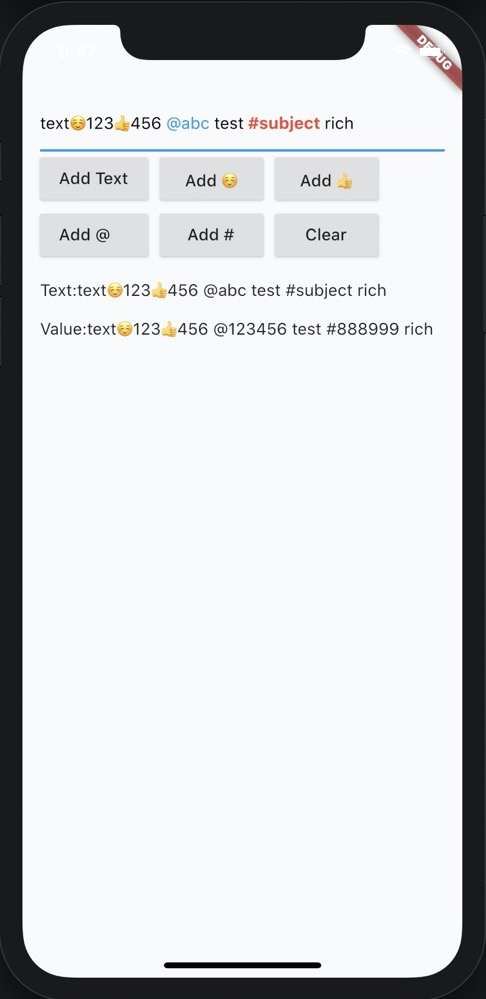

# flutter_rich_input 不再维护，使用了更好的方式，新启动了一个新的 rich_input 插件，[点击这里查看](https://pub.dev/packages/rich_input)

这是一个高性能的富媒体输入框，通过原生的 textfield 扩展实现，具有较小的破坏性，同时具有较强的扩展性，实现了@某人，#话题，表情等功能，支持自定义高亮

文档语言: [English](README.md) | [中文简体](README-ZH.md)

## 特色功能

-   用较少的代码，尽量使用原生的 textfield 能力，减少破坏性及后续兼容性
-   支持@某人 #话题 插入表情等
-   支持自定义高亮效果，甚至实现自己的渲染方式
-   支持自定义 value 字段，增强富文本的能力



## 开始入门

```dart
import 'package:flutter/material.dart';
import 'package:flutter_rich_input/block/rich_block.dart';
import 'package:flutter_rich_input/flutter_rich_input.dart';

void main() {
  runApp(MyApp());
}

class MyApp extends StatelessWidget {
  @override
  Widget build(BuildContext context) {
    return MaterialApp(
      title: 'Flutter Demo',
      home: MyHomePage(),
    );
  }
}

class MyHomePage extends StatefulWidget {
  @override
  _MyHomePageState createState() => _MyHomePageState();
}

class _MyHomePageState extends State<MyHomePage> {
  RichInput _richInput;
  FocusNode _focusNode;

  @override
  void initState() {
    _focusNode = FocusNode();
    _richInput = RichInput();
    // refresh text and value
    _richInput.controller.addListener(() {
      setState(() {});
    });
    _richInput.addText("text");
    super.initState();
  }

  @override
  Widget build(BuildContext context) {
    return Scaffold(
      body: SafeArea(
        child: Padding(
          padding: const EdgeInsets.all(15),
          child: Column(
            crossAxisAlignment: CrossAxisAlignment.start,
            children: <Widget>[
              _richInput.textField(focusNode: _focusNode),
              Wrap(
                spacing: 10,
                children: [
                  RaisedButton(
                    onPressed: () {
                      _richInput.addText("text");
                    },
                    child: const Text("Add Text"),
                  ),
                  RaisedButton(
                    onPressed: () {
                      _richInput.addText("😁");
                    },
                    child: const Text("Add 😁"),
                  ),
                  RaisedButton(
                    onPressed: () {
                      _richInput.addText("👍");
                    },
                    child: const Text("Add 👍"),
                  ),
                  RaisedButton(
                    onPressed: () {
                      final at = RichBlock(text: " @abc ", value: " @123456 ");
                      _richInput.addBlock(at);
                    },
                    child: const Text("Add @    "),
                  ),
                  RaisedButton(
                    onPressed: () {
                      final at = RichBlock(
                        text: " #subject ",
                        value: " #888999 ",
                        style: const TextStyle(
                          color: Colors.red,
                          fontWeight: FontWeight.bold,
                        ),
                      );
                      _richInput.addBlock(at);
                    },
                    child: const Text("Add #"),
                  ),
                  RaisedButton(
                    onPressed: () {
                      _richInput.clear();
                    },
                    child: const Text("Clear"),
                  ),
                  RaisedButton(
                    onPressed: () {
                      _focusNode.unfocus();
                    },
                    child: const Text("unfocus"),
                  )
                ],
              ),
              const SizedBox(height: 10),
              Text("Text:${_richInput.text}"),
              const SizedBox(height: 10),
              Text("Value:${_richInput.value}"),
            ],
          ),
        ),
      ),
    );
  }
}
```

> 主要通过 RichInput 提供额外的 api，通过 RichInput.textfield 提供和原生 textfield 一致化的接口
